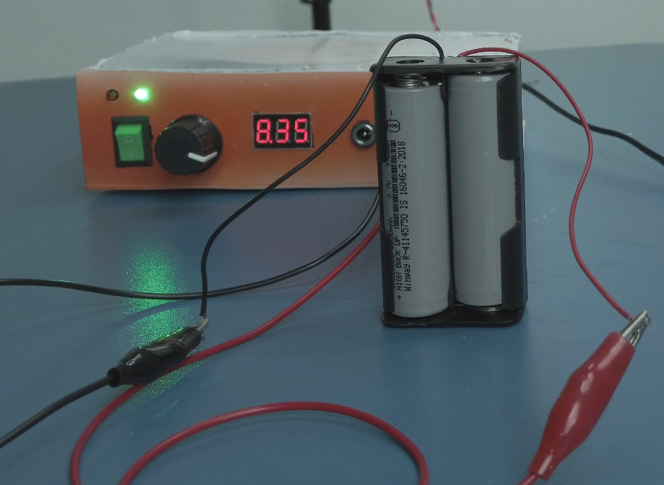
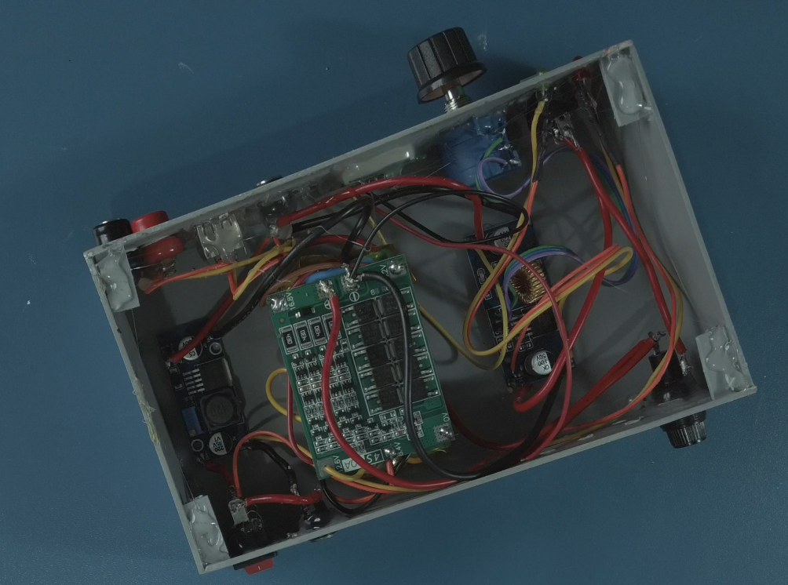
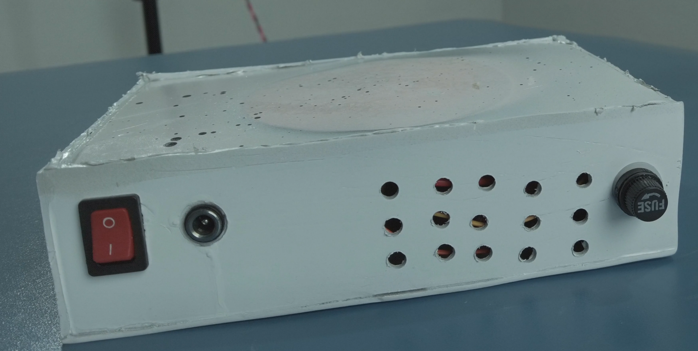

# 🔋 Portable Workbench Power Supply

🔥 DIY Portable Workbench Power Supply with adjustable output (**1.25V – 10V**) for electronics testing and lab work.

---

---

## ⚡ Quick Start

1. Connect 12V input power
2. Turn ON the switch
3. Adjust voltage using knob
4. Monitor voltage on display
5. Use required output (DC / USB / Banana terminals)

---

## ⚡ Features

- Adjustable output voltage (**1.25V – 10V**)
- Built-in voltmeter for real-time monitoring
- Precision control knob
- 2+ hours battery backup
- Lightweight & portable design
- Strong and durable build

### 🔌 Multiple Output Options

- DC output pins
- USB output (5V)
- Banana plug terminals

### 🛡️ Protection

- 10A fuse protection
- Safe for electronics testing

---

## 💡 Why This Project?

- Portable power supply for field work
- No programming required
- Beginner-friendly + practical use
- All-in-one compact solution

---

## 📸 Project Preview

### 🔧 Front View

### 🔍 Inside Components

### 🔌 Circuit Diagram

### 🔙 Back View

### ⚡ Output View

> Portable and compact power supply for electronics testing

---

## 🔧 Components Used

### 🔋 Power & Battery Section

- 18650 Lithium-ion Batteries (2500mAh) – 4 pcs (4S pack)
- 4S BMS (Battery Management System 40A)

### ⚡ Input / Charging Section

- 12V DC Female Connector (Input)
- 10A Fuse + Holder
- ON/OFF Switch – 2 pcs

### 🔄 Power Conversion Section

- DC-DC Step-Up Module (6009 / 6019)
- DC-DC Step-Down Module (4015)
- 10K Multi-turn Potentiometer

### 🔌 Output Section

- 12V DC Female Connector (Output)
- USB Female Connector (5V output)
- Banana Connectors (Red & Black)

### 💡 Indicators & Monitoring

- 7-Segment Voltmeter Display
- 5mm LEDs – 2 pcs (Red & Green)
- 1K Resistors – 2 pcs

### 🔧 Miscellaneous

- Connection wires (proper thickness recommended)
- Enclosure / Storage Box

---

## 🧠 Working Principle

The power supply uses DC-DC converter modules to regulate voltage.

- Input power is supplied through DC input
- Battery pack provides portable operation
- Step-up and step-down modules regulate voltage
- Output voltage is adjusted using potentiometer
- Voltmeter displays real-time voltage

This ensures stable and safe power for electronic testing.

---

## ⚠️ Safety Precautions

- Always check input voltage before connecting
- Ensure correct polarity
- Avoid short circuits
- Do not touch live wires
- Use proper insulation

---

## 🛠️ Build Notes

- No programming required
- Fully hardware-based design
- Simple wiring and module integration

---

## 🎯 Applications

- Electronics testing
- DIY projects
- Lab experiments
- Mobile repair workbench

---

## ❤️ Support

If you like this project:

⭐ Star this repo
👍 Share with others
🔔 Subscribe for more DIY electronics projects
