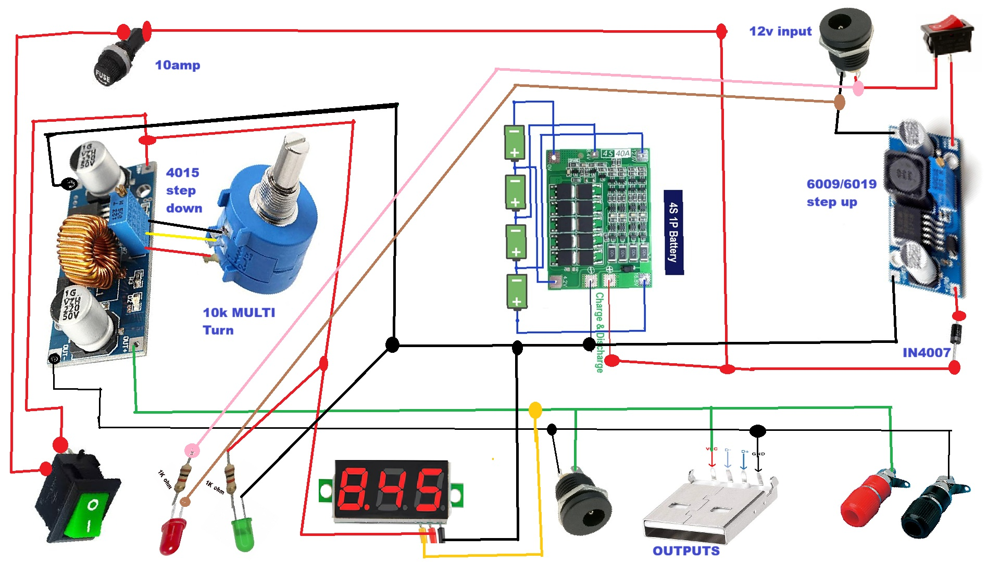

# portable-workbench-power-supply

## 📷 Project Images

### Front View

### back View

### Internal Circuit

### Final Output

### Final Output

## 🧠 Working Principle

The power supply converts input voltage into multiple regulated outputs using voltage regulator modules.  
It ensures stable voltage for testing electronic circuits safely.

---

## ⚠️ Safety Note

- Always check polarity before connecting devices
- Avoid short circuits
- Use proper insulation

---

## 🙌 Support

If you like this project, support by subscribing to the YouTube channel and sharing with others.
