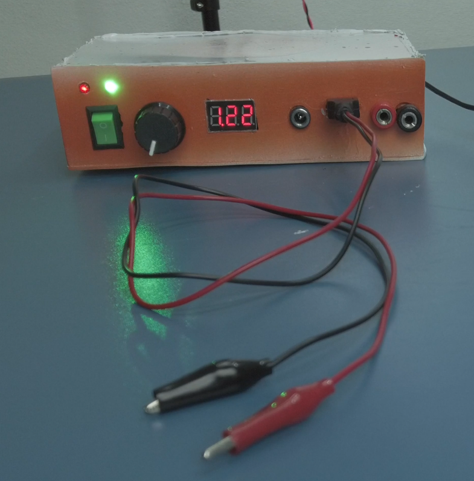
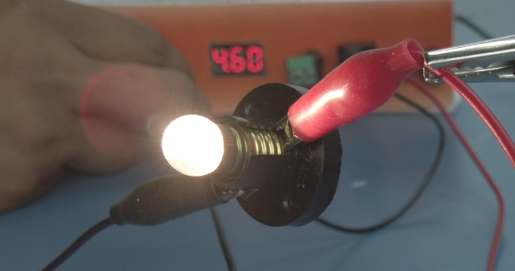

# 🔋 Portable Workbench Power Supply

DIY Portable Workbench Power Supply with adjustable output (1.25V – 10V)

---

## ⚡ Features

- Adjustable output voltage (1.25V – 10V)
- Built-in voltmeter for real-time voltage monitoring
- Control knob for precise voltage adjustment
- 2+ hours battery backup
- Lightweight and portable (easy to carry in bag)
- Strong and durable design
- Multiple output options:
  - DC output pins
  - USB output (5V)
  - Banana plug terminals
- Safety fuse protection (10A)
- Suitable for electronics testing and DIY projects

---

## 🔧 Components Used

### 🔋 Power & Battery Section

- 18650 Lithium-ion Batteries – 4 pcs (4S pack)
- 4S BMS (Battery Management System)

### ⚡ Input / Charging Section

- 12V DC Female Connector (Input)
- 10A Fuse + Holder
- ON/OFF Switch – 2 pcs

### 🔄 Power Conversion Section

- DC-DC Step-Up Module (6009 / 6019)
- DC-DC Step-Down Module (4015)
- 10K Multi-turn Potentiometer

### 🔌 Output Section

- 12V DC Female Connector (Output)
- USB Female Connector (5V output)
- Banana Connectors (Red & Black)

### 💡 Indicators & Monitoring

- 7-Segment Voltmeter Display
- 5mm LEDs – 2 pcs (Red & Green)
- 1K Resistors – 2 pcs

### 🔧 Miscellaneous

- Connection Wires (proper thickness recommended)
- Enclosure / Storage Box

---

## 📷 Project Images

### Front View

### Inside Components

### Circuit Diagram

### Back View

### Alternate View

> Portable and compact power supply for electronics testing

## 🧠 Working Principle

The power supply converts input voltage into multiple regulated outputs using voltage regulator modules.  
It ensures stable voltage for testing electronic circuits safely.
The system uses a DC input source which is regulated using buck converter modules to provide stable adjustable output voltage.

---

## ⚠️ Safety Precautions

- Always check input voltage before connecting
- Ensure correct polarity
- Avoid short circuits
- Do not touch live wires while powered
- Use proper insulation for all connections

---

## 🛠️ Build Notes

This project does not require any programming.

All outputs are generated using voltage regulator modules and proper wiring connections.

---

## 🎯 Applications

- Electronics testing
- DIY projects
- Lab experiments
- Mobile repair workbench

---

## 🙌 Support

If you like this project, support by subscribing to the YouTube channel and sharing with others.
